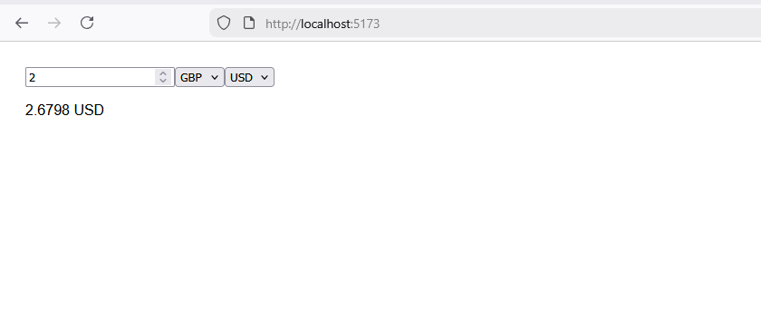

# React Currency Converter

A simple **currency converter** built with React using the [Frankfurter API](https://www.frankfurter.app/) to fetch live exchange rates. Converts between EUR, USD, BDT, and GBP.

## Demo

  

## Features

- Convert amounts between multiple currencies.
- Real-time exchange rates from Frankfurter API.
- Handles same-currency conversion without API requests.
- Loading indicator while fetching rates.
- Simple and responsive UI.

